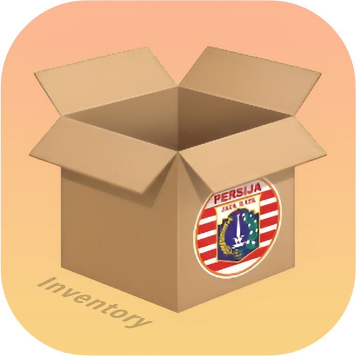

<div align="center">
  
  <h1>Inventori PWA</h1>
  <p>🚀 Modern Multi-Warehouse Inventory Management System</p>
  
  <p>
    
    
    
    
  </p>
</div>

## ✨ Overview

**Inventori PWA** adalah sistem manajemen inventaris gudang berbasis website modern dengan dukungan Progressive Web App (PWA). Sistem ini dirancang untuk menangani operasional multi-gudang (Gudang Pusat dan Cabang) secara tertutup, aman, dan meminimalisir kesalahan input melalui sistem *database transactions / locking*.

Secara visual, aplikasi ini menggunakan gaya desain independen dengan konsep **iOS Aesthetic & Light Glassmorphism**, tanpa bergantung pada utility framework seperti TailwindCSS — memastikan performa load yang tinggi dan kontrol penuh terhadap fungsionalitas UI.

## 🛠 Tech Stack

- **Backend:** Laravel 11, PHP 8.2+
- **Frontend SPA:** Vue 3 (Composition API), Inertia.js
- **Styling:** Custom Vanilla CSS (BEM Architecture, CSS Variables, Glassmorphism)
- **PWA:** `vite-plugin-pwa` (Service Worker, Offline Fallback, App Manifest)
- **Database:** MySQL / SQLite
- **Security:** CSRF Protection, Rate Limiting, Atomic Database Locks

## 🔥 Fitur Utama

- **📦 Multi-Warehouse Isolation:** Mendukung gudang Pusat (Main) dan berbagai Cabang. Admin Cabang hanya bisa mengakses dan melihat stok di cabang masing-masing.
- **🔄 Inter-Warehouse Transfers:** Sistem pengiriman stok parsial antar gudang (Pusat ↔ Cabang atau Cabang ↔ Cabang) lengkap dengan status Pending/Completed/Canceled.
- **📖 Audit Trail History:** Seluruh arus barang (Stock In, Stock Out, Transfer) dicatat secara presisi untuk pertanggungjawaban audit.
- **📱 PWA Ready:** Dapat diinstal selayaknya aplikasi *native* di Android, iOS, maupun Desktop (Google Chrome/Edge).
- **🛡 Enterprise Security:** Transaksi pengubahan stok dibungkus dalam `DB::transaction` dan *Pessimistic Locking* (`lockForUpdate`) untuk menghindari celah *Race Condition*.
- **🎨 Custom Design System:** Interface sangat responsif dengan animasi transisi yang mulus, modal dinamis, dan toast notification modern.

## 🚀 Instalasi & Menjalankan Service

Panduan untuk menjalankan project ini di komputer lokal Anda:

### 1. Clone Repository & Install Dependencies
```bash
git clone https://github.com/kadalmeinside/inventori-pwa.git
cd inventori-pwa

# Install PHP dependencies
composer install

# Install Javascript dependencies
npm install
```

### 2. Environment Configuration
```bash
cp .env.example .env
php artisan key:generate
```
Edit file `.env` dan sesuaikan koneksi database Anda.

### 3. Database Migration & Seeding
Menjalankan migrasi dan seeding data awal (Role, Gudang, dan Akun Default):
```bash
php artisan migrate:fresh --seed
```
*Note: Akun super admin default akan digenerate, periksa output terminal atau file seeder untuk kredensial default.*

### 4. Build PWA & Assets
Oleh karena project menggunakan module PWA, direkomendasikan untuk me-*running build* minimal satu kali untuk mem-build *Service Worker*.
```bash
npm run build
```
*(Atau gunakan `npm run dev` untuk hot-module-replacement selama masa development)*

### 5. Start Local Server
```bash
php artisan serve
```
Akses aplikasi melalui browser di `http://localhost:8000`.

## 🔒 Konfigurasi Produksi

Untuk mendeploy ke Production, pastikan beberapa environment berikut di atur pada file `.env`:
- `APP_ENV=production`
- `APP_DEBUG=false`
- Aplikasi **WAJIB** dihosting dengan sertifikat SSL (HTTPS). PWA Service Worker (fitur Install App) tidak akan memicu aktif apabila tidak di dalam protokol `https://` (kecuali di `localhost`).

## 👨‍💻 Kontributor

Di-develop dan di-maintain secara mandiri untuk standar kontrol inventaris. All rights reserved.
